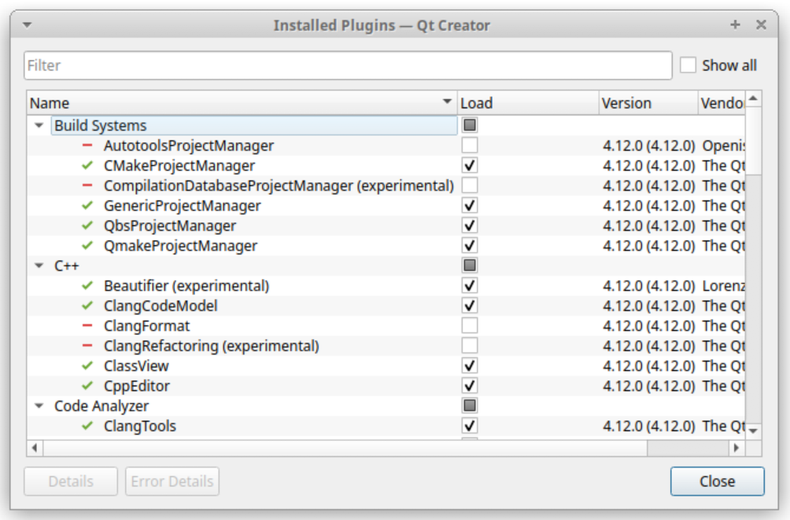
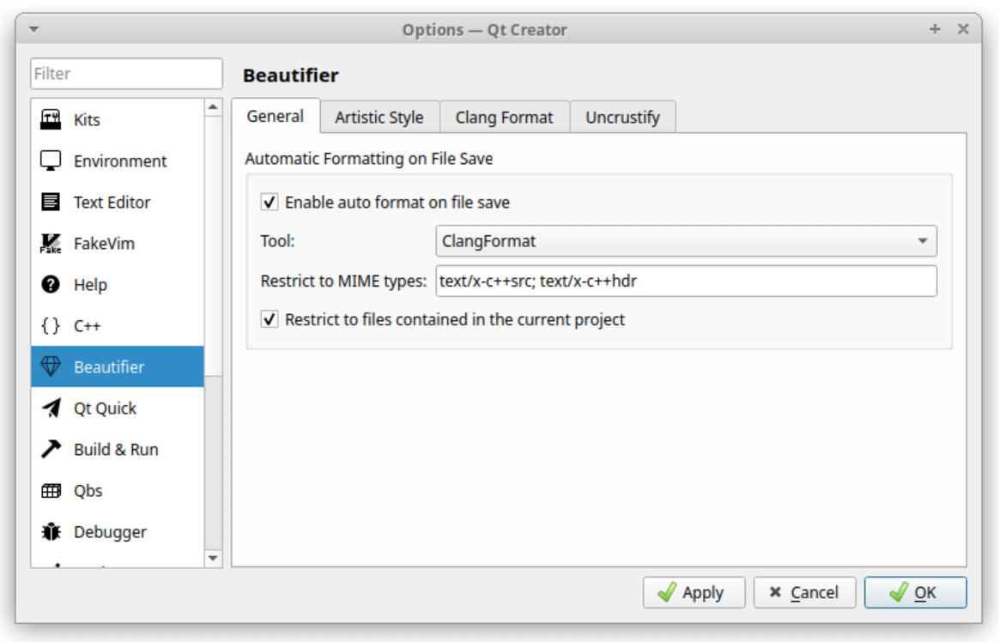
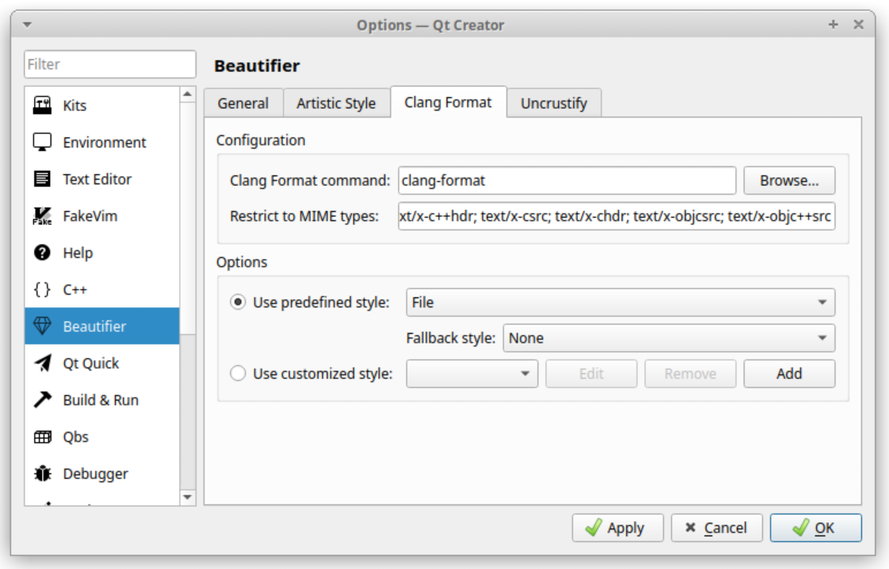
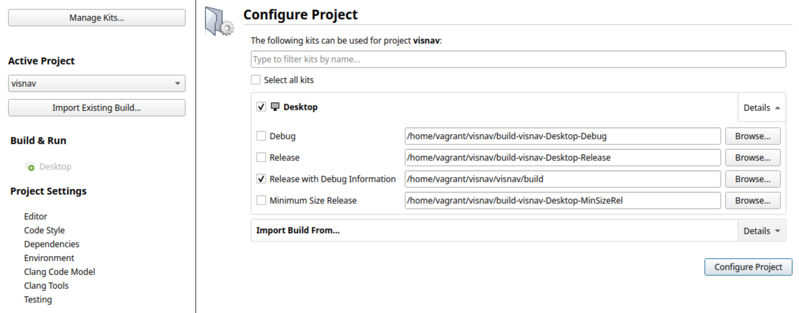
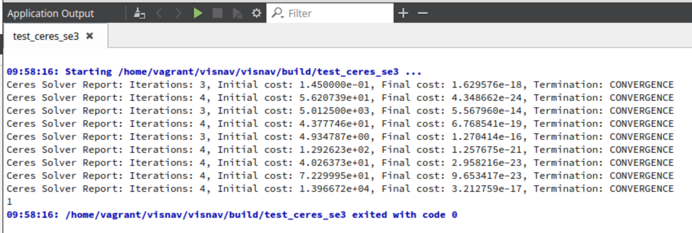
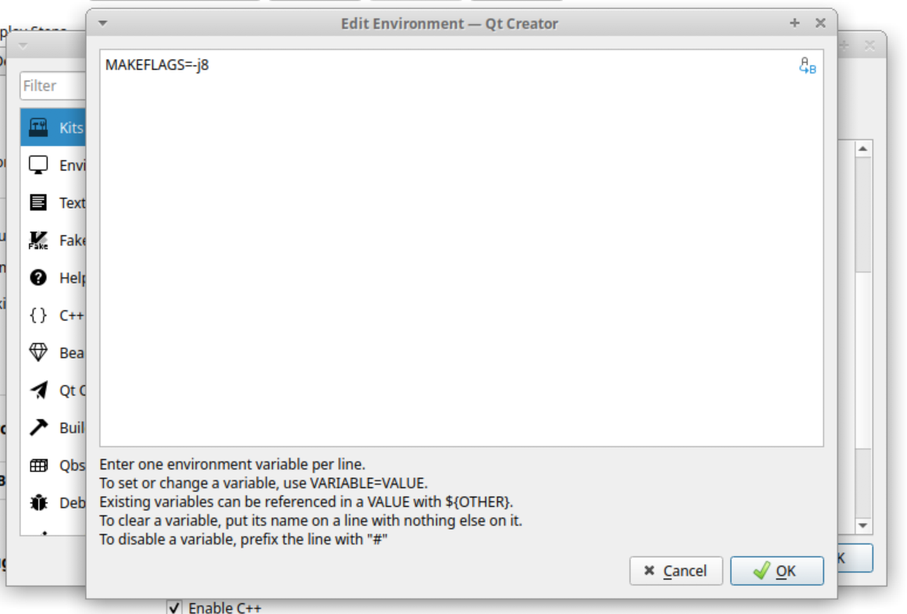
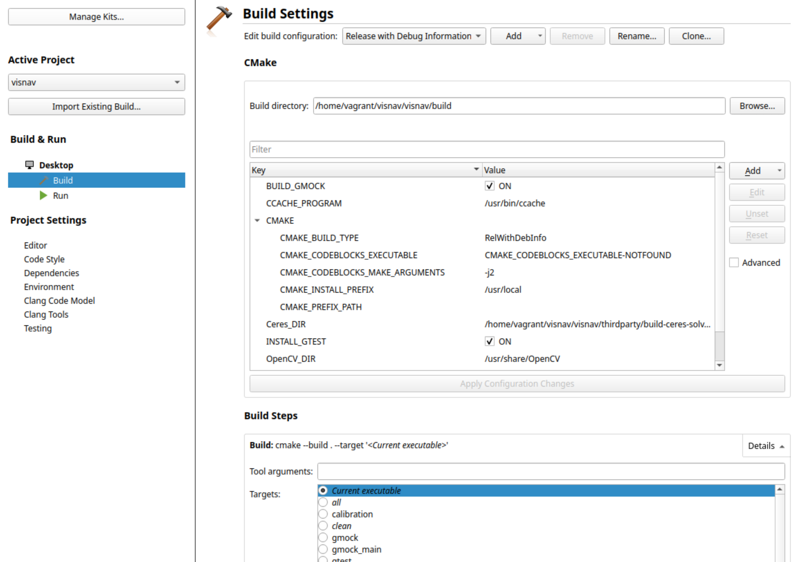
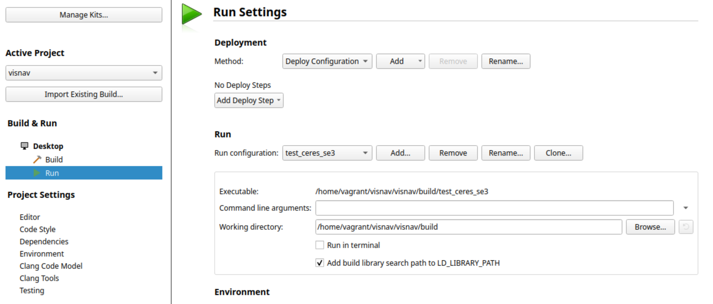
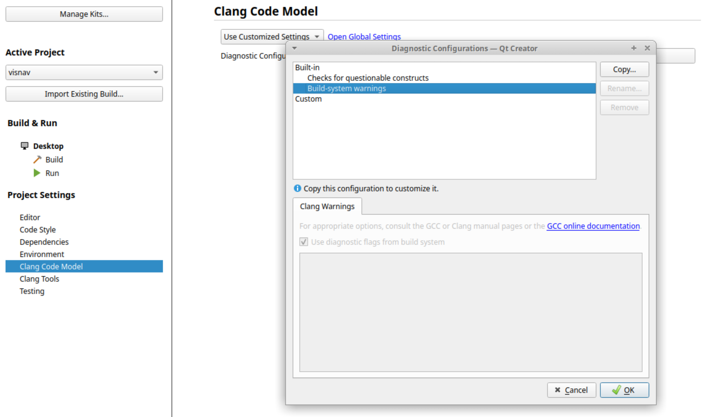

## Preliminaries and tutorials

**Git:**
* https://git-scm.com/docs/gittutorial
* https://learngitbranching.js.org/

**CMake:**
* https://cmake.org/cmake/help/latest/guide/tutorial/index.html
* https://github.com/ttroy50/cmake-examples

**Ceres:**
* http://ceres-solver.org/nnls_tutorial.html#curve-fitting
* https://ceres-solver.googlesource.com/ceres-solver/+/master/examples/curve_fitting.cc

## Installation

These instructions are meant for Ubuntu 18.04 or 20.04, or a recent version of macOS (we tested Catalina).
On other Linux distributions your milage may vary and you might need to adapt how dependencies are installed.

### Configure gitlab

After logging into https://gitlab.vision.in.tum.de you should
[setup your SSH key](https://docs.gitlab.com/ee/gitlab-basics/create-your-ssh-keys.html)
to easily pull/push from/to your repository.

### Get the sources

Clone the repository on your PC.
Use the `--recursive` option to directly get all submodules as well.

> **Note:** If you are doing this on the lab PCs **DO NOT** install it in your home folder because it is stored in the network.
> Make a directory `/storage/local/<username>` (`/storage/local/` is your local hard drive) and install everything there.

```
git clone --recursive git@gitlab.vision.in.tum.de:visnav_ws21/<username>/visnav.git
```

### Install and configure QtCreator

We use QtCreator as a C++ IDE because of it's decent support of CMake
projects, syntax highlighting, interactive debugging and automatic
formatting with clang-format. Note that we do not use the Qt GUI framework
in our code.

Download and install **a recent version** QtCreator.
We recommend to go for the latest release (currently 4.14), but it should be at least 4.8.
The default version shipping with Ubuntu 18.04 is out of date. 
You will also need `clang-format`.

> **Note:** On the lab PCs, everyting should be preinstalled. If not, ask your instructors to run
> ```
> sudo apt install qtcreator-4.14 clang-format
> ```
> You can start this version of QtCreator from the terminal with the command `qtcreator-4.14`.
> Make sure to not by accident start the default version that comes with Ubuntu.

> **Note:** For your own PC with Linux, you can download and install QtCreator as follows.
> Recently, the installer started to require setting up a Qt account.
> We don't need the Qt account for anything after installation.
>
> ```
> wget https://download.qt.io/official_releases/qtcreator/4.14/4.14.2/qt-creator-opensource-linux-x86_64-4.14.2.run
> chmod +x qt-creator-opensource-linux-x86_64-4.14.2.run
> ./qt-creator-opensource-linux-x86_64-4.14.2.run
> ```
> On Ubuntu 18.04, the system cmake version doesn't satisfy the minimum requirement for QtCreator 4.14. 
> You should install a recent release of cmake via pip (install pip with `sudo apt install python3-pip` if missing):
> ```
> python3 -m pip install --user -U cmake
> ```
> In this case, you will have to set the new cmake path in QtCreator, which is described below, and if you additionally want to use cmake from the command line, you have to prepend `~/.local/lib/python3.6/site-packages/cmake/data/bin` to your PATH environment variable (e.g. in your `.bashrc` file).
>
> You can get `clang-format` from the apt package:
>
> ```
> sudo apt install clang-format
> ```

> **Note:** On macOS, you can use [Homebrew](https://brew.sh/):
>
> ```
> brew cask install qt-creator
> brew install clang-format
> ```

After installation, go to `Help` -> `About Plugins...` (`Qt Creator` -> `About Plugins...` on macOS) in the menu and enable `Beautifier` plugin:



Go to `Tools` -> `Options` (`Qt Creator` --> `Preferences` on macOS) and select the `Beautifier` tab. There select `ClangFormat` as the tool in the `General` tab.



Select `File` as predefined style in the `Clang Format` tab. Also select `None` as the fallback style.

> **Note:** On macOS, it might be that the `clang-format` executable is shown in red font, which means it is not found.
> Try to enter `/usr/local/bin/clang-format` in the `Clang Format command` field.



Ubuntu 18.04 users who want to use QtCreator 4.14 and have successfully installed cmake using pip need to set the path of the CMake executable. Go to `Tools` -> `Options` and select the `Kits` tab. There, in the `CMake` tab, press `Add` and enter the path of the CMake executable: `~/.local/lib/python3.6/site-packages/cmake/data/bin/cmake`. Press the `Apply` button.
Then, go to the `Kits` tab and select the kit you are using for this project(`Desktop` by default). For `CMake Tool`, choose the option that you have just created. Don't forget to press `OK`.

### Build the Project
First, install the dependencies and build project sub-modules.

> **Note:** On the lab machines, you need to skip the `./install_dependencies.sh` step. Everything should be preinstalled. Else, ask your instructors.

```
cd visnav
./install_dependencies.sh
./build_submodules.sh
```

In QtCreator, go to `File` -> `Open File or Project...`, and select the `CMakeLists.txt` file in the top-level folder of the cloned code repository.
Configure the project with only the `Release with Debug Info` configuration.
Change the build directory to point to the `build` directory directly inside the top-level folder of the clone repository, i.e. `<your_installation_path>/visnav/build`.
(Initially, the `build` folder is not there. It will be created on the first build.)



After that you should be able to build and run the project.
To verify that installation worked well run the `test_ceres_se3` executable.
(First select the executable, then run it. Both can be done at the lower left inside QtCreator.)
You should get the following output:




## Additional QtCreator Configuration

We suggest you also apply the following additional configuration tweaks in QtCreator.

Go to `Projects` on the left side-pane, then select `Manage Kits...` and configure the kit that you use for the `visnav` project (`Desktop` by default).
There, configure the `Environment` and add the variable `MAKEFLAGS=-j8` (instead of `8` choose the number of (virtual) CPU cores you have).
This ensures that when you compile, the build runs in parallel.



Back on `Projects`, select `Build` under `Build & Run`.
On `Build Steps` -> `Build` -> `Details`, select `Current Executable` under `Targets`.
This ensures that QtCreator builds not all binaries each time you press `Build`, but only the one of the currently selected run-configuration.
That can save a lot of compile time.



Back on `Projects`, select `Run` under `Build & Run`. Ensure that `Run in terminal` is not selected.
Here you can later also configure command line arguments and the working directory for the applications you will develop.



Back on `Projects`, select `Clang Code Model` under `Project Settings`.
Select `Use Customized Settings`, then for `Diagnostic Configurations` select `Build-system warnings`.
This ensures that the interactive warnings that QtCreator displays are the same as the build system shows during compilation.



## Code submission
Every exercise contains a set of automatic tests that verify the correctness of the solution.
All test are located in the `test` folder.
By default, all tests are commented in CMake. There is `test_ex0` with which you can test the submission system (see the first exercise sheet).
You can select it now and run it locally.
To run the tests on the Gitlab server, you should push your changes to your own branch and make a merge request against the `master` branch.
This will show the changed files and automatically run tests on the server.
If all tests passed your solution is correct and we will merge the changes in your `master` branch.
It is best to start a new branch for every exercise sheet (e.g. `ex1`, `ex2`, ...), such that you can start work on the next exercise while waiting for you merge request to be verified and merged.

## Resources

In the code repostiory you can find the exercise sheets in the `exercise_sheets` folder.
Copies of referenced papers are provided in the `literature` folder.


## FAQ

### 1. Can I access the lab machines from home via SSH?

You can access lab PCs using the following command
```
ssh -p 58022 <your_username>@atcremers55.vision.in.tum.de
```
You should use the hostname of your PC instead of `atcremers55`.

### 2. Do I need to use QtCreator? I prefer another IDE...

We don't require you to use QtCreator, but we recommend it for the
following reasons:

- decent cmake support
- option to run clang-format on file-save
- good visual debugger
- code-navigation and syntax highlighting works well

If you use another IDE, please make sure that clang-format is run
before committing files. You can also use the `run_format.sh` script
to reformat all files before commiting.

### 3. Compilation is slow...

Yes, compile times can unfortunately be slow.

When developing, make sure to only compile as much as is needed, not
all executables.  For example, from the command line call `make
-j4 calibration`, to only build the `calibration` executable.

In QtCreator, you can go to `Projects -> Build -> Build Steps ->
Targets` and select `Current Executable` instead of `all`, to only
build the currently selected executable when running "build"
(Ctrl+B). The current executable is the one selected for "running".

### 4. Eigen troubleshooting

We include a recent version of Eigen in the project as a submodule to make sure everyone uses the same exact version. Often errors related to Eigen are caused by the compiler picking up the system-wide Eigen version instead of the Eigen version provided in the project.

##### Check cmake output

One thing you should always do to troubleshoot Eigen is carefully checking the cmake output. Cmake tells you where it detected Eigen. If this is inside your project folder `.../thirdparty/eigen/`, then that seems ok.

```
Found required Ceres dependency: Eigen version 3.3.4 in /Users/demmeln/work/teaching/visnav_ws18/visnav_ws18/thirdparty/eigen
```

Otherwise, Eigen detected in `/usr/local/...` might be problematic.

##### Use correct include paths

One other cause of Eigen errors like

```
visnav_ws18/thirdparty/Sophus/sophus/so2.hpp:98:40: error: 'ScalarBinaryOpTraits' in namespace 'Eigen' does not name a template type
   using ReturnScalar = typename Eigen::ScalarBinaryOpTraits<
```

is if you use `#include <eigen3/Eigen/...>`, since this again will find the system-wide Eigen version in `/usr/local/eigen3/Eigen/...`. Instead, use `#include <Eigen/...>`.
